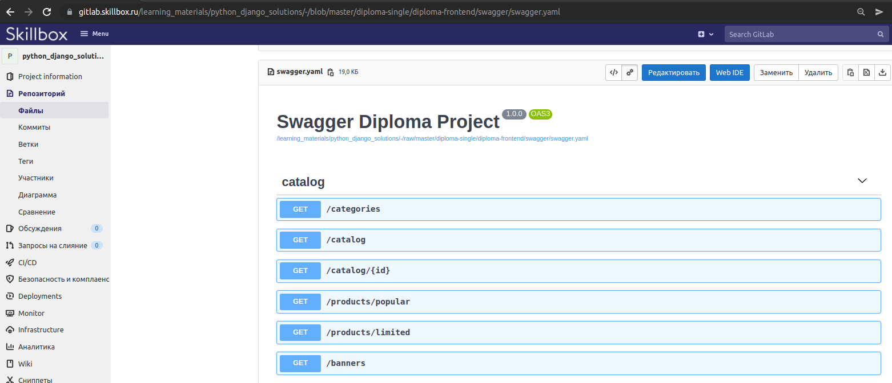

# Общая часть

## Что из себя представляет проект
Предтаавляет собой подключаемое django-приложение. Берет на себя все что связано с отобоажением страниц, а обращение 
за данными происходит по API, который необходимо реализовать в ходе выполения задания дипломного проекта.

## Контракт для API
Названия роутов и ожидаемую структуру ответа от API endpoints можно найти в `diploma-frontend/swagger/swagger.yaml`. 
Для более удобного просмотра swagger-описания рекомендуется использовать возможности gitlab:


## Подключение пакета
Вот исправленная глава по подключению пакета с добавлением настроек Poetry:

# Подключение пакета

1. **Сборка пакета**:  
   В директории `diploma-frontend` выполнить команду:
   ```bash
   python setup.py sdist
   ```
   Будет создан дистрибутив пакета в формате `tar.gz` в папке `dist/`.

2. **Установка пакета**:
   - Для установки через pip:
     ```bash
     pip install diploma-frontend-X.Y.tar.gz
     ```
     (где X.Y - версия пакета)
   - Для добавления в проект на Poetry:
     ```bash
     poetry add ./diploma-frontend/dist/diploma-frontend-X.Y.tar.gz
     ```
     Или добавить зависимость вручную в `pyproject.toml`:
     ```toml
     [tool.poetry.dependencies]
     diploma-frontend = {path = "./diploma-frontend/dist/diploma-frontend-X.Y.tar.gz"}
     ```
     Затем выполнить:
     ```bash
     poetry install
     ```

3. **Настройка Django**:
   В `settings.py` проекта добавить приложение:
   ```python
   INSTALLED_APPS = [
       ...
       'frontend',
   ]
   ```

4. **Настройка URL**:
   В `urls.py` проекта добавить:
   ```python
   urlpatterns = [
       path("", include("frontend.urls")),
       ...
   ]
   ```

После запуска сервера разработки (`python manage.py runserver`) по адресу `127.0.0.1:8000` должна открыться стартовая страница интернет-магазина:


